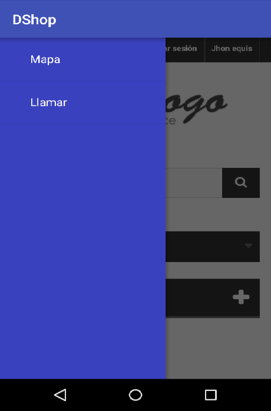
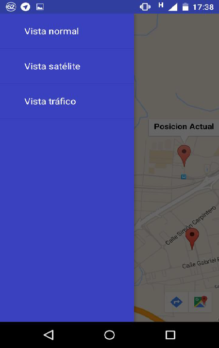

## DShop

Example floating sidebar with embedded browser.

###Screenshot





### Motivation

We wanted to learn about game development . This is a great way to get into the game world in a simple way .

## Contributors

	David Ruiz Martin-Romo: 
	<https://github.com/daviles94/>

### License
```
    Copyright (C) 2016
    
	This file is part of naveGame.
	
    naveGame is free software: you can redistribute it and/or modify
    it under the terms of the GNU General Public License as published by
    the Free Software Foundation, either version 3 of the License, or
    any later version.
    
    This program is distributed in the hope that it will be useful,
    but WITHOUT ANY WARRANTY; without even the implied warranty of
    MERCHANTABILITY or FITNESS FOR A PARTICULAR PURPOSE.  See the
    GNU General Public License for more details.
	
	You should have received a copy of the GNU General Public License
    along with this program.  If not, see <http://www.gnu.org/licenses/>.
```
